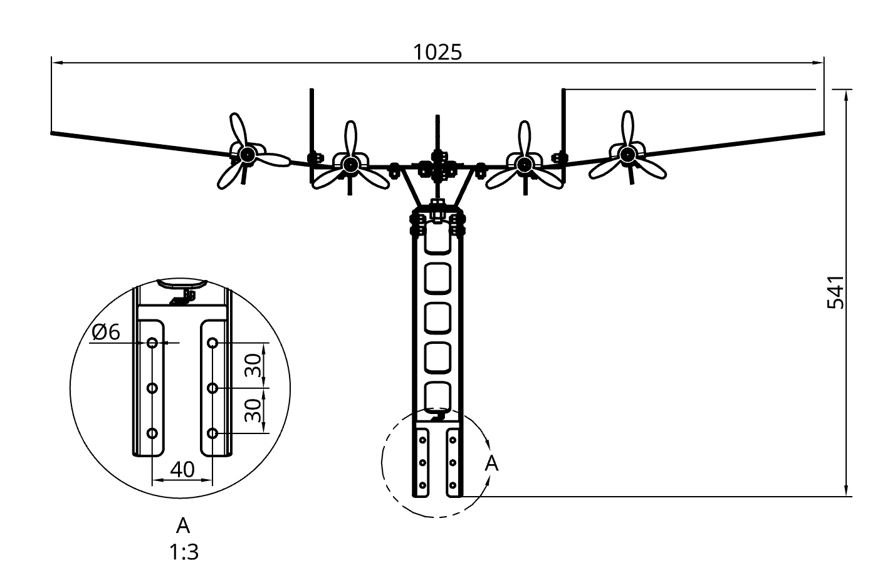

# Lancaster Bomber Build

Firstly, thank you for purchasing one of our Lancaster Bomber kits and supporting our small business. 

Please consider leaving using a [Review](https://www.facebook.com/LincsLabs/reviews) once you've completed your build. It really helps us bring you new and exciting products.

The following information will help you assemble your v1 LincsLabs Lancaster Bomber.

!!! Danger "Wear Appropriate PPE"
    We strongly reccomend wearing safety glasses and gloves throughout assembly. It's likely there are some sharp edges remaining from the cutting and bending processes. 
    

There are two assemblies that make up the Lancaster:

- The Plane - We'll build this first.
- The Bracket - We'll attach this to the wall, then attach the plane to the bracket.

 

## Help

If during the build you notice an issue with your kit, or an error in the build instructions, please reach out to us via our [contact us](https://lincslabs.co.uk/pages/contact) page. We'll be back in touch asap.

## Timing

Expect assembly to take about 60 minutes.

## You'll need

- Your packaged Lancaster Bomber.
- A clear, flat table top for assembly.
- 4mm and 6mm allen (hex) keys.
- 10mm, 13mm and 17mm spanners.
- Power drill and 6mm masonary drill bit (if fixing to a masonary wall)

!!! tip
    If you have access to a bench vice, you can use this to hold the plane fusealage and make assembly a little easier.

## Next steps

Let's start with [unboxing](lancaster/unbox.md)

