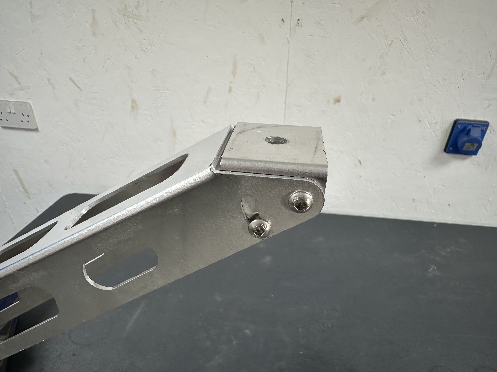
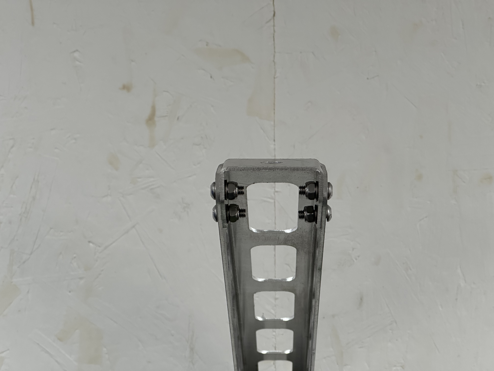

## Pivot Mount

The bracket is made up of the pivot mount - (which is what the Lancaster will bolt too) and the wall bracket.

Slide the pivot mount into the wall bracket as shown in the below photo.

Add in the 4x M6 screws, **keep these loose** as they allow you to move the mount around as you want to position the Lancaster.

## Fixing to the Wall

The Lancaster can be secured wherever you'd like to see it! The bracket and plane assembly weigh approximately 3.5kg - so bare this in mind when picking your mounting location.

If you're planning on attaching to a masonary or brick wall, we've included 6x 5x50mm stainless steel posi-drive screws and wall plugs to do so.

Offer up the bracket to where you want it without the Lancaster attached, use a spirit level to check it's level and sqaure, then mark the holes in the bracket with a marker pen.

Drill the holes out with a 6mm masonary drill bit, then insert the supplied wall plugs and screw the bracket on.

If you're fixing to wood it's best to drill a small pilot hole to start with, 2-3mm should be fine, then just screw the bracket straight on.

## Attaching the Lancaster

Now the bracket is secured to it's final location, it's time to attach the Lancaster!

Offer the plane up to the pivot mount and slide the M10 bolt into the locating hole.

Now thread on the Nylock nut with the washer behind it.

Rotate the Lancaster fuselage to the position you want to secure it at, then tighten the M10 bolt with either 2x 17mm spanners or a 17mm spanner and socket.

Manoeuvre the plane to it's final position then tighten the 4x M6 screws on the pivot mount.

## Finshed!

That's it, you're all finished! We hope you love your Lancaster as much as we loved making it.

Don't forget to snap a photo and tag us in it on [Facebook](https://www.facebook.com/profile.php?id=61563332027667) or [Instagram](https://www.instagram.com/lincslabs/) @LincsLabs.

If you do you like your Lancaster and are pleased with how we've delievered, please consider leaving us a [review](https://www.facebook.com/LincsLabs/reviews) it really helps us bring you new and exciting products.

If you'd like to stay up-to-date on the latest products available from us, be sure to sign up for our mailing list. We'll reach out when we've got something good to share!