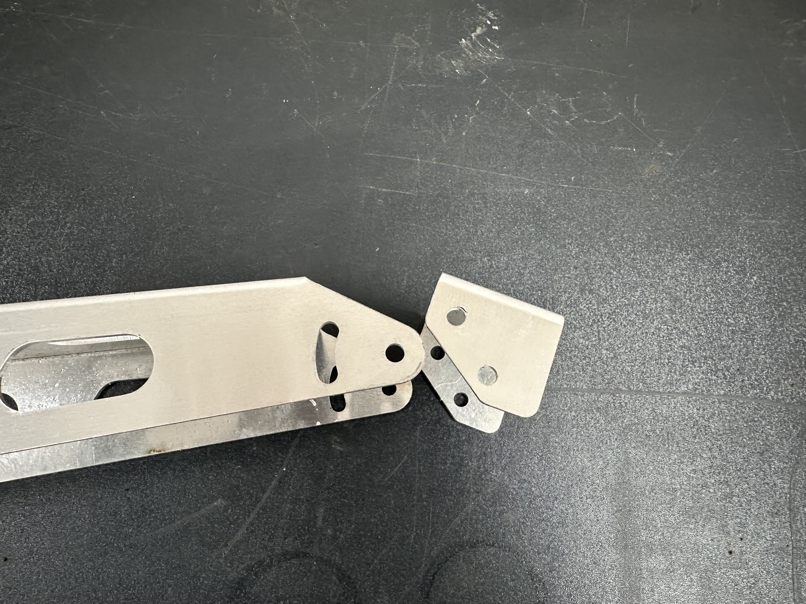
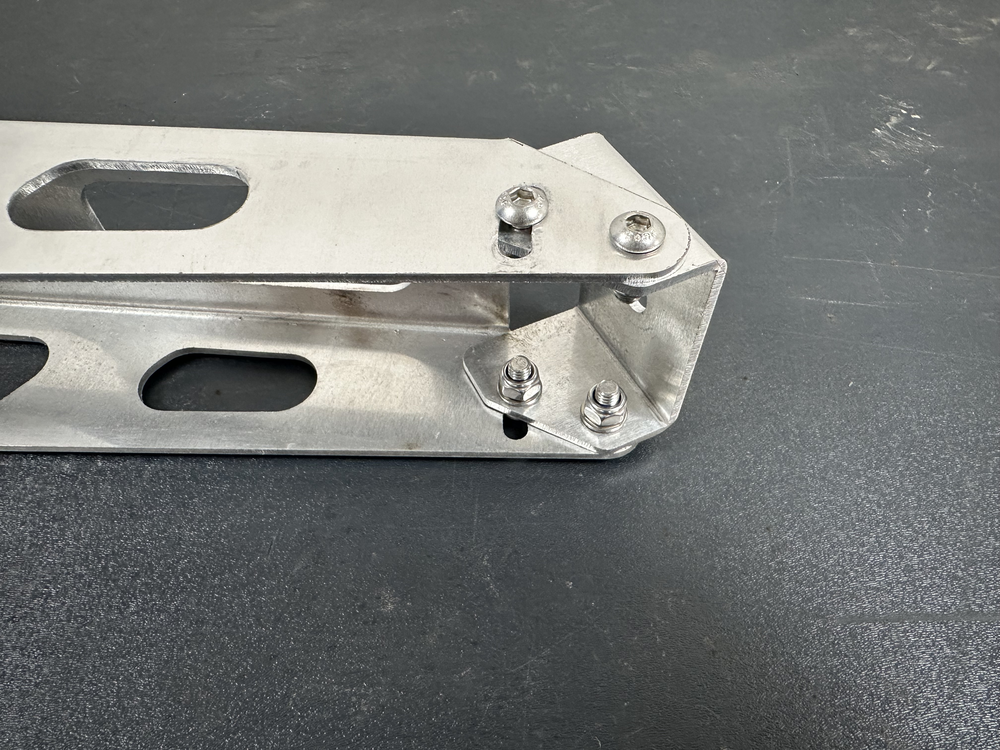
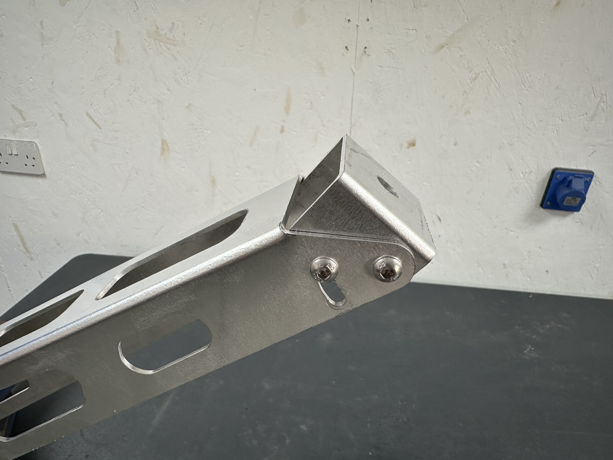

## Pivot Mount

The bracket is made up of the pivot mount - (which is what the Lancaster will bolt too) and the wall bracket.

Slide the pivot mount into the wall bracket as shown in the below photo.

Add in the 4x M6 screws, **keep these loose** as they allow you to move the mount around as you want to position the Lancaster.

## Fixing to the Wall

## Attaching the Lancaster

## Finshed!

That's it, you're all finished! We hope you love your Lancaster as much as we loved making it.

Don't forget to snap a photo and tag us in it on Facebook or Instagram @LincsLabs.

If you do you like your Lancaster and are pleased with how we've delievered, please consider leaving us a [review](https://www.facebook.com/LincsLabs/reviews) it really helps us bring you new and exciting products.

If you'd like to stay up-to-date on the latest products available from us, be sure to sign up for our mailing list. We'll reach out when we've got something good to share!