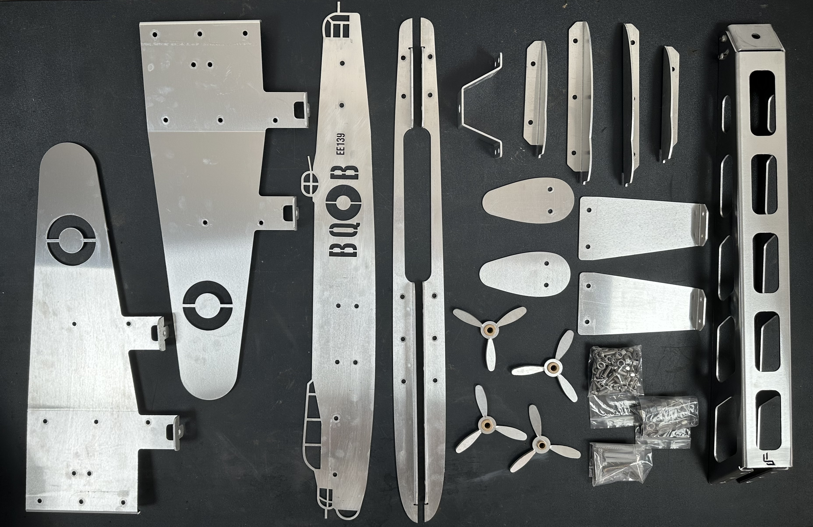
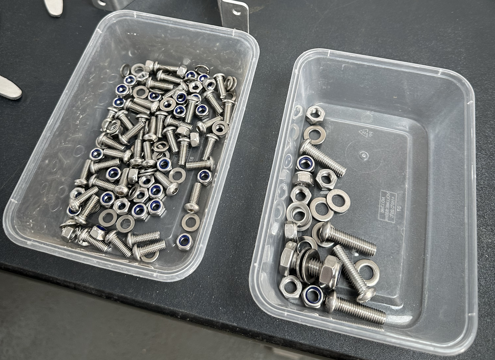
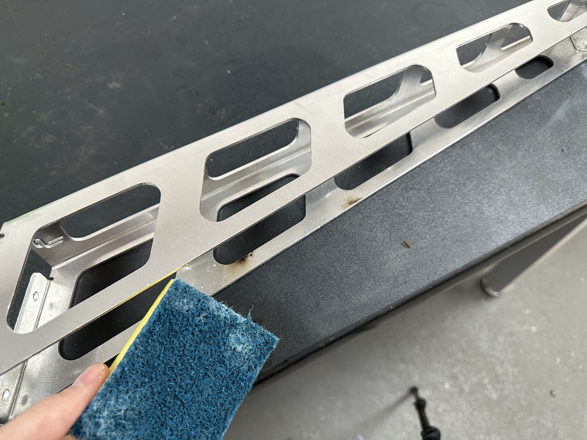
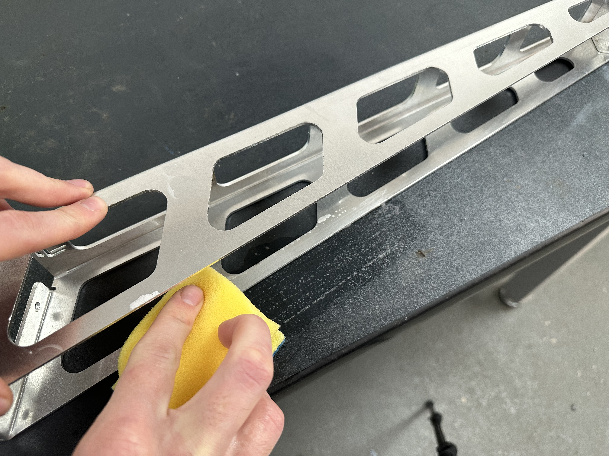
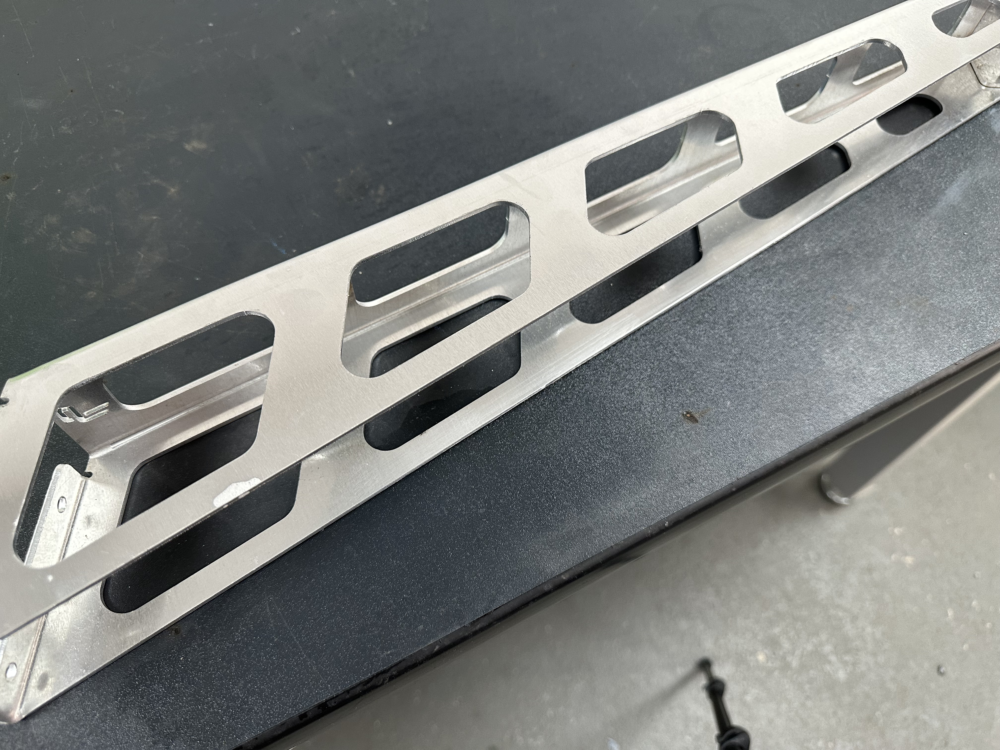
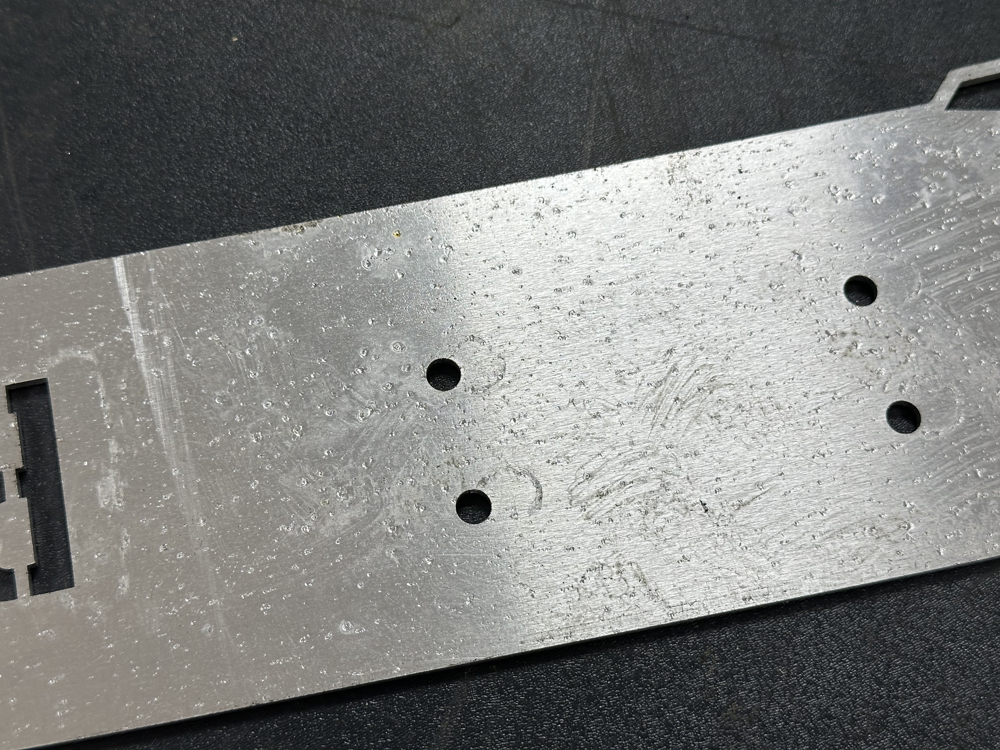

Start by removing all of the components within the cardboard box. 

The box should contain:

- 1x Fuselage
- 2x Wing Brackets
- 2x Wings
- 1x Mounting Bracket
- 2x Tail Brackets
- 2x Tail Fins
- 2x Small Engines
- 2x Large Engines
- 4x Propellers (with olite brass bushes pre-installed)
- 1x Wall bracket
- 1x Pivot mount
- 1x Bag containing all M6 stainless fixings
    - 40x M6x16mm Socket Button Screws
    - 40x M6 Nyloc Locking Nuts
    - 40x M6 Flat Washers
- 1x Bag containing M8 and M10 stainless fixings
    - 4x M8x30mm Socket Button Screws
    - 8x M8 Flat Washers
    - 4x M8 Plain Nuts
    - 4x M8 Nyloc Locking Nuts
    - 1x M10x25mm Hex Head Screws
    - 2x M10 Flat Washer
    - 1x M10 Nyloc Locking Nut
- 1x Bag containing wall mount fixings
    - 6x 5x50mm Posi-Drive stainless Screws
    - 6x 6mm Wall Plugs

!!!Tip
    It's useful to empty the fixings into containers for easier access during assembly!

    

## Surface Marks and Cleaning

Some aluminium parts may arrive with minor surface scratches, discoloration, or a light protective oil coating. These marks are a byproduct of the laser cutting and bending process. We know they’re not ideal — but unfortunately, they’re unavoidable at this stage of manufacturing.

To clean and improve the finish:

Use a sponge with warm, soapy water to remove any discoloration and oil residue.

For surface scratches, gently polish the part using a Brillo pad or Scotch-Brite. This will help blend the scratches and improve the overall appearance.

These steps are optional but can help improve the final finsh.

## Missing something?

[Reach out](https://lincslabs.co.uk/pages/contact), we'll make it right.

## Next steps

Next, you'll assemble the [plane](plane.md)
