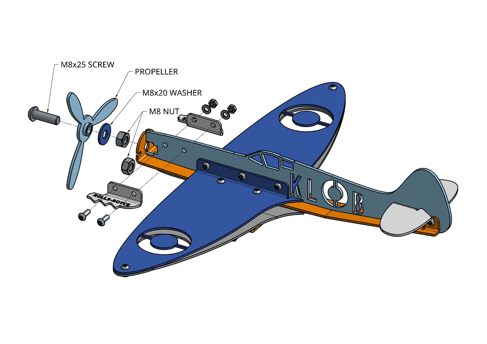

# Supermarine Spitfire Build

Thank you for purchasing one of our Spitfire kits! The following information will help you assemble your Spitfire.

## Help

If during the build you notice an issue with your kit, or an error in the build instructions, please reach out to us via our [contact us](https://lincslabs.co.uk/pages/contact) page. We'll be back in touch asap.

## Timing

Expect assembly to take about 30 minutes.

## You'll need

- Your packaged Spitfire.
- A clear, flat table top for assembly.
- 2.5mm allen (hex) key.
- 7mm, 10mm and 13mm spanners.

!!! DANGER "SHARP EDGES"
    There are likely to be sharp edges present in the laser cut parts. Please be careful during assembly and wear protective gloves when appropriate.

!!! TIP "SURFACE MARKS & CLEANING"
    The nature of laser cut parts means there will likely be some small laser burn marks/light scratches the metal work along with some protective oil. This is totally normal and can be easily cleaned/buffed up if preffered. Please see our additional [guidance](lancaster/unbox.md/#surface-marks-and-cleaning).

## Assembly Instructions

### Bottom Wing

!!! TIP "TIP"
    You'll need your 2.5mm allen key and 7mm spanner for all M4 SCREWS.
    
    Make sure the small opening of the scoop is at the rear of the wing and that the 2x M4x12 SCREWS (The longer ones) are positioned correctly as shown.

### Wing Brackets

### Fuselage

### Attaching Bottom Wing

### Engines, Tails & Prop

!!! TIP "TIP"
    Ensure the 8mm NUT is position correctly inbetween the two engines halves - this captivates the nut and allows you to tighten the propeller up next.

!!! TIP "TIP"
    You'll need the 13mm spanners to attach the propeller.
    
    Nip the two M8 nuts together with 1x 13mm spanner, when you do this, the propeller should spin freely.

### Bracket

!!! TIP "TIP"
    You'll need the 10mm spanners to attached the plane to the bracket.

That's it, you're all done! We really hope you enjoy your new Spitfire model.

Please consider leaving us a [review](https://www.facebook.com/LincsLabs/reviews) once you've completed your build. It really helps us bring you new and exciting products.

